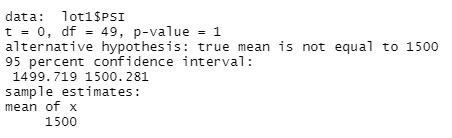
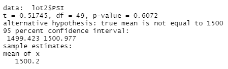
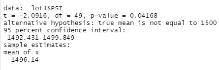

# MechaCar Vehicle Production Data Analysis Using R

## Overview

The purpose of this analysis is to assist AutosRU with their prototype vehicle **MechaCar**. The MechaCar is experiencing technical issues. Data has been collected from three different lots of MechaCars. A statistical analysis of the data will assist the manufacturing team understand what may be causing the issues in the vehicles. The statistical analysis will be completed using R and its dplyr library.

## Results

### Linear Regression to Predict MPG

#### Takeaways

- The variables/coefficients: *vehicle length* and *ground clearance* both have a very low P values (significantly lower than .05). This indicates that these both have an impact on the vehicle's overall performance (Miles Per Gallon). These appear to be the only statistically significant variables.

- The linear model has an r squared value of *.71*. This means the model explains 71% of the variability. While 100% would be ideal, the model does predict the mpg effectivaely. The p value of the linear model is *0.0000000000535*. This is significantly lower than the widely accepted cutoff of .05. The null hypothesis must be rejected as it appears that atleast some of the variables have a significant impact on the vehicles performance.

### Summary Statistics on Suspension Coils

The design specifications for the MechaCar suspension coils dictate that the variance of the suspension coils must not exceed 100 pounds per square inch. Does the current manufacturing data meet this design specification for all manufacturing lots in total and each lot individually?

It appears that overall the data does meet the design specification (PSI variance < 100). As per the analysis, the calculated variance for all 3 lots is 62.29, which is less than 100. However, the below image breaksdown the calculated variance of each lot. 

It is apparent that lot 3 has significant issues as the variance is calculated at 170.28. Lot 3 does not meet the design specification regarding PSI variance.

### T-Tests on Suspension Coils

This analysis indicates that the average PSI variance across all lots is not statiscally significant. The p value (.06) suggests the null hypothesis cannot be rejected.

**Lot 1 T-Test**

Lot 1 of MechaCar prototypes resulted in a statistical analysis with a p-value of 1. The variance of PSI in this lot is not statiscally different from that of the population (all 3 lots). The null hypothesis cannot be rejected.

**Lot 2 T-Test**

Lot 2 of MechaCar prototypes resulted in a statistical analysis with a p-value of .60. The variance of PSI in this lot is not statiscally different from that of the population (all 3 lots). The null hypothesis cannot be rejected.

**Lot 3 T-Test**

Lot 3 of MechaCar prototypes resulted in a statistical analysis with a p-value of .04. The variance of PSI in this lot **IS** statiscally different from that of the population (all 3 lots). The null hypothesis is rejected. 

### Study Design: MechaCar vs Competition 